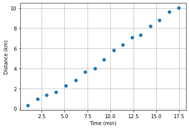
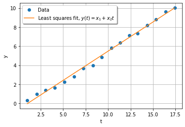

In this section, I will give a brief overview of what kind of errors you will encounter in numerical calculations. I will also introduce a motivating and useful example.

## Round-off Error

The way most mathematical operations work on a computer are not exact. To illustrate this, consider the following example.[^1]

We know that
$$
(x+y)+z=x+(y+z)
$$
but the computer doesn't inherently know this. Take for example `x=1e20` ($1\times 10^{20}$), `y=-1e20` and `z=1`. What does Python give us? To see this, run the following code,
```
# initialise variables
x=1e20
y=-1e20
z=1

# evaluate expressions
print((x+y)+z)
print(x+(y+z))
```
The output is
```
1.0
0.0
```
What happened?! Python evaluates first the sum in brackets, then the rest, so in the first example `x+y` cancels and then you add `z`, but in the second example, `y+z` is very nearly just `y`, and then you add `x` and the results cancel. This is an example of _round-off error_. This is a result of the way real numbers are represented on a computer.

## Cancellation Error
TODO [^test]

## Modelling Error
TODO maybe discuss Taylor series and the derivative?

TODO also mention real world error (see OLS). Could also just have the wrong function of the job (using linear regression for something that's quadratic, etc.), or sometimes you are using an incomplete theory (maybe you shouldn't neglect friction, maybe you are using classical mechanics for quantum mechanics, etc)

## Ordinary Least Squares Linear Regression

As a motivating example, both for the basic error analysis described above, as well as to give you something "solid" and "real" to think about, let's discuss how to fit a line to a bunch of collected data.

If you want to try this yourself or follow along, the data is [here](sec1_2_data.csv).

As an admittedly mundane example, say you want to determine how fast you run in a 10 km race, so you have a friend keep track of how far on the track are you every minute. From that, you want to infer your speed by taking the slope of the line formed by the data collected by your friend.

Let's say you complete this task and get the following data.
{:refdef: style="text-align: center;"}

{: refdef}

Now, you _could_ just take the first and the last points, draw a line between them, and find the slope (and this case it wouldn't even be such a bad estimate) but you want something more robust (and generalisable) and you want to make sure your friend's time wasn't wasted by taking all those extra points in the middle. Obviously, if you just draw this line it will not go through every point.[^2]

This is called a fitting problem, and for this particular problem we will try to fit a line to the data, since we expect it to be approximately linear (and the plot confirms this). That is, we have a pair of $m$ pairs $(t_i, y_i)$ ($i=1,...m$), i.e. the data points, to which we want to fit a line
$$
y(t) = x_1 + x_2 t.
$$
In this notation, each pair $(t_i, y_i)$ represents a data point measured at time $t_i$ and distance $y_i$, $y(t)$ is the estimated distance as a function of time, and $x_1$ and $x_2$ are parameters for us to determine (in this case, our estimates for the y-intercept and the slope, respectively). Of course, we want $y(t_i)=y_i$ ideally, or at least
$$
y(t_i)\approx y_i.
$$

There are many ways to formulate this, but certainly the most common is _least squares_. In this model, we take the difference between the measured data $\bm y:=(y_1,y_2,...,y_m)^T$ and what our model predicts $(y(t_1),y(t_2),...,y(t_m))^T$. The solution to this problem, is then the vector $\bm x:=(x_1,x_2)^T$, as this fully describes $y(t)$. It is typically convenient to convert the problem to a matrix equation, and in this case this can be accomplished by noting

$$
\bmat
y(x_1)\\
y(x_2)\\
\vdots \\
y(x_m)
\emat
\approx
\underbrace{
\bmat
1 & t_1 \\
1 & t_2 \\
\vdots & \vdots \\
1 & t_m
\emat
}_{:=A}
\bmat
x_1 \\
x_2
\emat
$$

where I have named the matrix $A$. It is then clear that we want to somehow minimise the difference between the model and the data, called the _residuals_, $\bm r:=A\bm x-\bm y$. However, there is no clear way directly minimise this, as it is a matrix, so the most common way to do this is to minimise their norm squared.[^3] [^4] Hence, we want

$$
\frac 1 2 \min_{\bm x} \norm{A\bm x-\bm y}
$$

where the $\frac 1 2$ is there by convention (scaling by a constant will not change the answer for $\bm x$).

There are many different optimisation algorithms to deal with problems of this form. However, this is a particularly simple case and one of the few times there is a closed form solution. To see this, we can proceed by the standard procedure from calculus 1 of differentiating our function (in this case $f(\bm x):= \frac 12 (A\bm x -\bm y)$) and setting it equal to zero. That is, the conditions for the minimum is[^partialderiv]

$$
\frac{\p}{\p x_k} f(\bm x) = 0
$$

for $k=1,...m$. That is, [^minimise]

$$
A^TA\bm x = A^T \bm y.
$$

Hence, we get a system of $$ equations for $m$ unknowns. These are called the _normal equations_. We can now easily read off the solution

$$
\bm x = (A^TA)^{-1}A^T\bm y.
$$

Normally, alarms should be going off when you see we want to invert a matrix, as this is an expensive operation (and the bottle neck for many algorithms). However, for now we shall ignore it, and for small data sets it is not a problem.[^cholesky]

Now, the task simply becomes reading $\bm y$ and $\bm t$ into numpy arrays, constructing $A$ and doing the matrix multiplications to get $\bm x$. The resulting curve fitted to the data should look like this:

{:refdef: style="text-align: center;"}

{: refdef}

[Here](fit.ipynb) is my code for the fit, but I encourage you to try it yourself.

We should also think about the errors in this problem. There will certainly be round-off error (as this is unavoidable), and if you did it right there should be minimal cancellation error. However, there is clearly modelling error as the data does not perfectly line up. Perhaps we need a higher-order polynomial? This can sometimes be a tricky question, but we also don't want to _overfit_ our data (if we have a wildly oscillating high-order polynomial fit to the data, we will get a tiny error, but at the cost of our model no longer making sense for the problem). In this case, the linear model seems to be a good one, and the error is unavoidable errors from the "real world."

<hr>

[Next Lesson](sec1_3)

[Previous Lesson](sec1_1)

<hr>


[^1]: This was taken from [here](https://github.com/PHY407-UofT/lectures-2018/blob/master/Lecture01/L01%20-%20python%20basics.ipynb)

[^2]: Based on the rest of what is discussed in this section you might be able to guess why in this scenario you wouldn't be able to just draw a line and be done. Answer: your friend likely did not make perfect measurements (real world/measurement error), and you do not run at a constant speed (modelling error).

[^3]: Note that minimising $\norm{\bm r}$ and $\norm{\bm r}^2$ results in the same $\bm x$ solution. Typically we work with the square just because it is easier and computationally less expensive (as we do not need to square root).

[^4]: While this norm is the most popular, sometimes you may see people use other norms, but these only have a few use cases. For example, minimising instead \\(\norm{\bm r}\_1:=\\sum\_{i=1}^m \|r\_i\| \\) can be useful for avoiding influence from outliers. However, the method discussed here cannot be used for these other norms.

[^partialderiv]: if you haven't seen expressions like $\frac{\p f(x,y,z)}{\p y}$, don't worry about it. It just means taking the derivative of $f$ with respect to $y$ keeping all other other variables ($x$ and $z$) constant. For example, if $f(x,y,z)=axz+bz^2-cyz$, then $\frac{\p f}{\p y}=2bz-cy$.

[^minimise]: Go ahead and do the minimisation yourself, it's not too hard, especially if you learn matrix differentiation rules (which I would encourage).

[^cholesky]: If you are interested, typically you factor the matrix $A^TA$ by what is called _Cholesky factorisation_ first. Anyway, most of the time you do this you will just be calling a library, and these are usually very well optimised under the hood (still, it is useful to understand how they work).